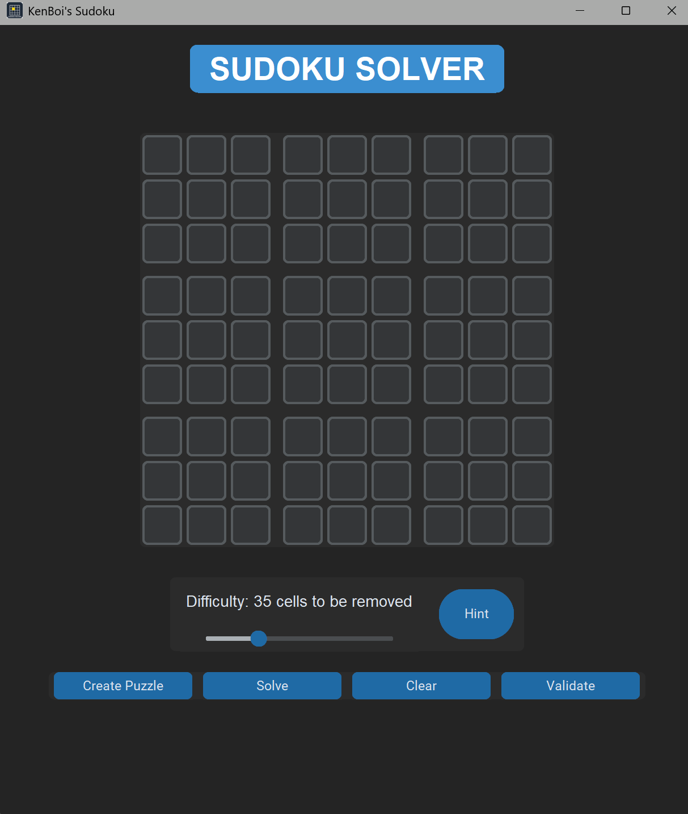
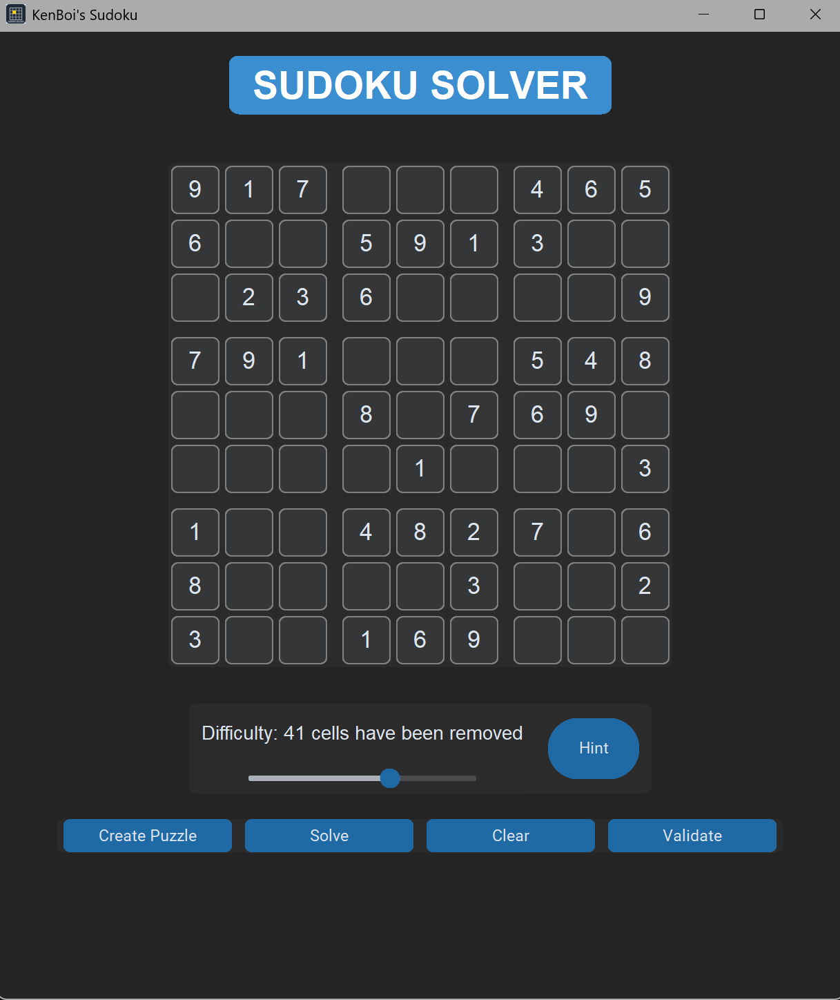
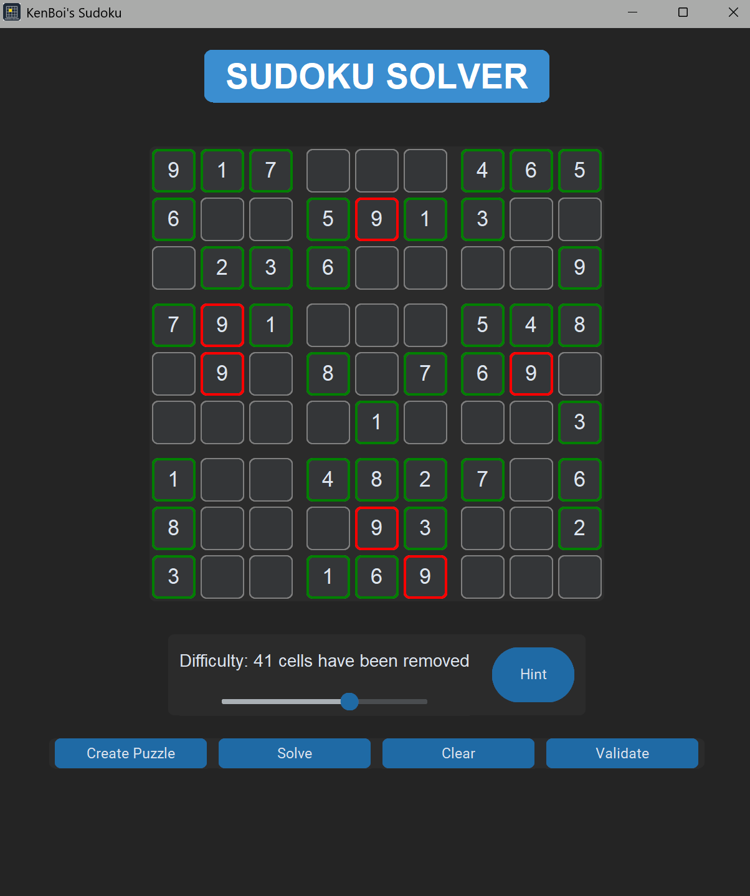
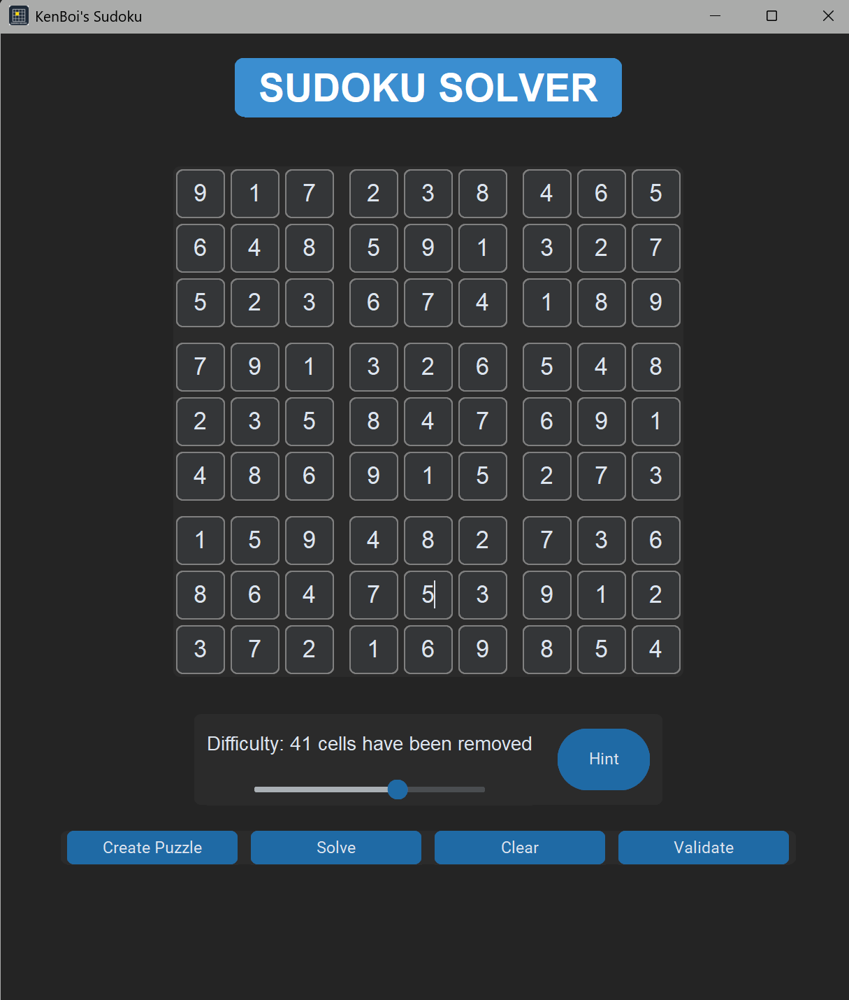
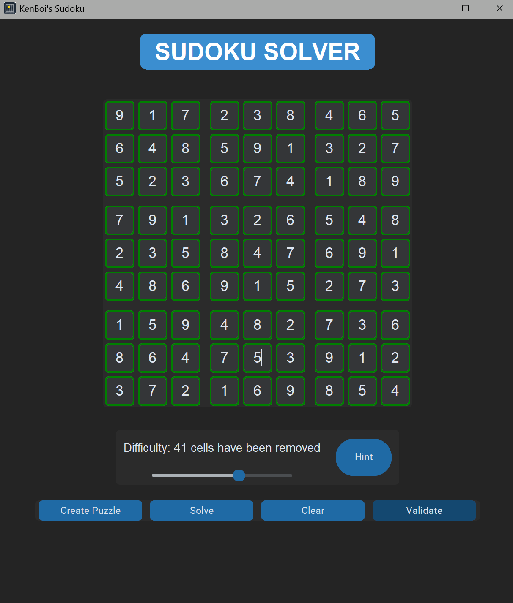

# KenBoi's Sudoku

KenBoi's Sudoku is a feature-rich desktop application built with **Python** and **customTkinter** that lets you play, generate, and solve Sudoku puzzles through a clean, modern UI. Designed for both casual players and Sudoku enthusiasts, it blends logic, interactivity, and visual feedback.

> This was a passion project to explore GUI design, backtracking algorithms, and user-centered experience development.

---

## ✨ Features

- **Generate Puzzle** – Create a new random Sudoku puzzle every time  
- **Difficulty Slider** – Remove 20 to 55 cells to control puzzle hardness  
- **Hint System** – Request up to 5 hints per puzzle  
- **Validate Entries** – Highlights correct (green) and incorrect (red) inputs  
- **Auto-Solve** – Solves the current puzzle using a backtracking algorithm  
- **Clear Board** – Reset the puzzle and hint counter  
- **Sleek Dark-Themed UI** – Built with `customTkinter` for a modern, responsive feel  

---

## 🕹️ How to Play

1. **Create Puzzle** – Click "Create Puzzle"  
2. **Adjust Difficulty** – Use the slider to remove 20–55 random cells  
3. **Play** – Click on empty cells and enter numbers (1–9)  
4. **Get Hints** – Reveal correct numbers (max 5 per puzzle)  
5. **Validate** – Instantly check your current entries  
6. **Solve** – Auto-complete the puzzle  
7. **Clear** – Reset everything and start over  

---

## 🚀 Getting Started

### Prerequisites
Make sure Python 3 is installed on your system.

### Installation
Install the required dependencies:
```bash
pip install customtkinter pillow
```

# Screenshots





